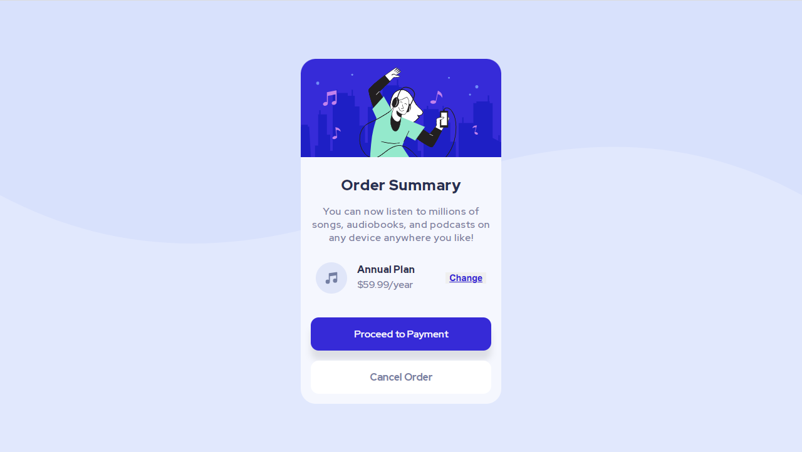
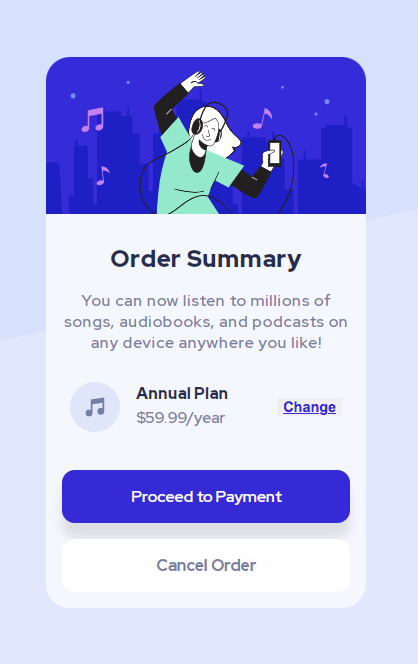

# Frontend Mentor - Order summary card solution

This is a solution to the [Order summary card challenge on Frontend Mentor](https://www.frontendmentor.io/challenges/order-summary-component-QlPmajDUj). Frontend Mentor challenges help you improve your coding skills by building realistic projects. 

## Table of contents

- [Overview](#overview)
  - [The challenge](#the-challenge)
  - [Screenshot](#screenshot)
  - [Links](#links)
- [My process](#my-process)
  - [Built with](#built-with)
  - [What I learned](#what-i-learned)
  - [Useful resources](#useful-resources)
- [Author](#author)

### The challenge

Users should be able to:

- See hover states for interactive elements

### Screenshot

### Links

- Solution URL: [https://www.frontendmentor.io/solutions/order-summary-component-using-css-flexbox-QpTxAQht3n]
- Live Site URL: [https://order-summary-component-by-kate.netlify.app/]

## My process

### Built with

- Semantic HTML5 markup
- CSS custom properties
- Flexbox
- Mobile-first workflow

### What I learned

I learned the importance of using multiple 'div' elements when working with Flexbox to position elements accordingly. 

### Useful resources

- [https://www.frontendmentor.io/solutions/order-summary-component-using-css-flexbox-QpTxAQht3n] Code with Mr Coder on Youtube.
- [https://www.youtube.com/watch?v=uaM5F8O_VI8] Code with TsbSankara on Youtube.

## Author

- Website - [Coming soon...]
- Frontend Mentor - [@web3wizardess](https://www.frontendmentor.io/profile/web3wizardess)
- Twitter - [@web3wizardess](https://www.twitter.com/web3wizardess)