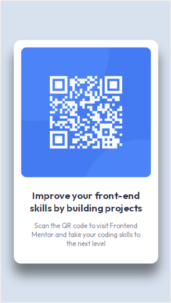

# Frontend Mentor - QR code component solution

This is a solution to the [QR code component challenge on Frontend Mentor](https://www.frontendmentor.io/challenges/qr-code-component-iux_sIO_H). Frontend Mentor challenges help you improve your coding skills by building realistic projects. 

## Table of contents

- [Overview](#overview)
  - [Screenshot](#screenshot)
  - [Links](#links)
- [My process](#my-process)
  - [Built with](#built-with)
  - [What I learned](#what-i-learned)
  - [Useful resources](#useful-resources)
- [Author](#author)

## Overview

### Screenshot

### Links

- Solution URL: [https://www.frontendmentor.io/solutions/qr-card-component-using-css-grid-and-flexbox-jjby7hQhUo]
- Live Site URL: [https://qr-code-component-by-kate.netlify.app/]

## My process

### Built with

- Semantic HTML5 markup
- CSS custom properties
- Flexbox
- CSS Grid

### What I learned

I learned a new way to center the card container within the page using CSS Grid instead of Flexbox.

I also learned the importance of layout and adding readable content for screen readers. 
I found the solution to the acccessibility error from this site:
https://www.w3schools.com/accessibility/accessibility_heading_levels.php

I added a header above the main with an h1 and class of "sr-only". I then set the visibility off using the css code below.

CSS class .sr-only that is only accessible for screen readers: 

.sr-only { position: absolute; 
          left: -10000px; 
          top: auto; 
          width: 1px; 
          height: 1px; 
          overflow: hidden; }

### Useful resources

- [https://www.youtube.com/watch?v=kdmeiXWRxcY] - I followed along with this Youtube tutorial first.
- [https://www.youtube.com/watch?v=ANOz2JJqcgc]- Then I compared the coding to this Youtube tutorial.
- [https://www.youtube.com/watch?v=JFyMWwOxHYM]- Finally I really enjoy following -TsbSankara- 

## Author

- Website - [Coming soon...]
- Frontend Mentor - [@web3wizardess](https://www.frontendmentor.io/profile/web3wizardess)
- Twitter - [@web3wizardess](https://www.twitter.com/web3wizardess)

